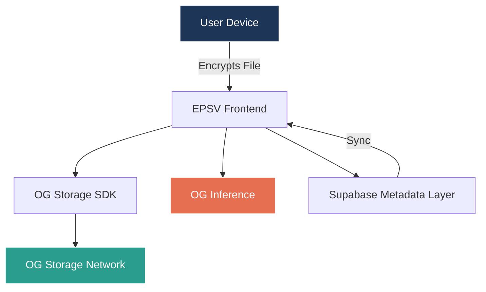
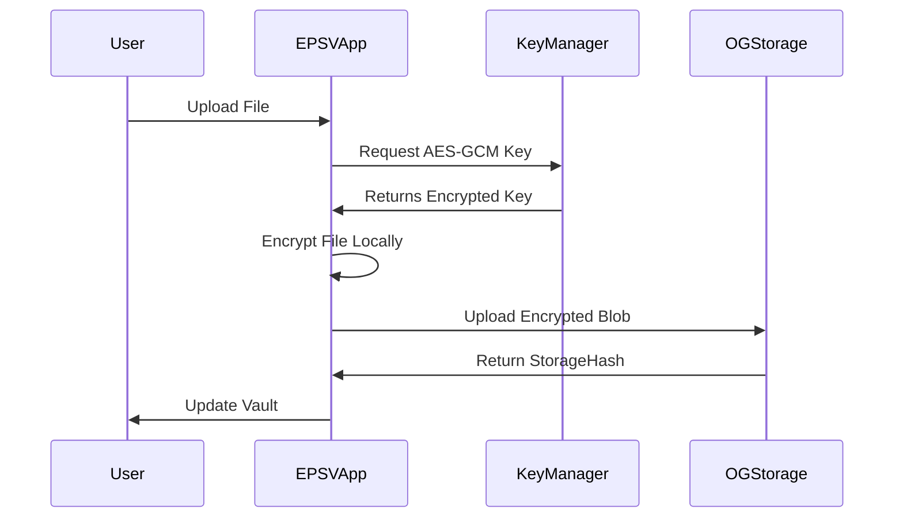

SCREENSHOTS

# 🔐 Encrypted Personal Storage Vault (EPSV)

---

## Overview

The **Encrypted Personal Storage Vault (EPSV)** is a decentralized, user-controlled storage system built on the **OG Chain ecosystem**.
It empowers individuals and organizations to store, access, and intelligently manage **sensitive data (documents, contracts, IDs, credentials, etc.)** with strong encryption, **AI assistance**, and **privacy guarantees** — powered by **OG Storage** and **OG Inference**.

EPSV combines **end-to-end encryption**, **on-chain access control**, and **decentralized AI inference** to ensure data is always:

* **Secure** (AES-GCM client-side encryption, key isolation)
* **Private** (no unencrypted data leaves the device)
* **Intelligent** (privacy-safe AI tagging, summaries, and vault suggestions)
* **Decentralized** (stored and verifiable on OG Storage)

---

## Core Features

### 🔐 1. End-to-End Encryption

* Every file is encrypted **client-side** with AES-GCM before upload.
* Only the vault owner holds the decryption key — not even the network nodes can access content.
* Supports multi-member access — shared vaults decryptable only by listed wallet addresses.

---

### 📦 2. Decentralized Storage via OG Storage

* Integrates the **OG Storage SDK** for verifiable, cost-efficient uploads.
* Files are stored on the **OG decentralized storage layer**, returning a **StorageHash** for proof and retrieval.
* All data remains encrypted end-to-end.

---

### 🧠 3. AI-Powered Intelligence via OG Inference

* Uses **OG Inference** for privacy-preserving, local-first intelligence.
* Automatically generates context-aware metadata and smart tags for each file.
* Enables **AI-assisted search, categorization, and summaries** without exposing file content.
* Supports:

  * **AI Auto-Vaulting** → Suggests themed vaults (“Legal Docs,” “NFT Assets,” etc.)
  * **Context-Aware Summaries** → Generates key points upon decryption (PDFs, videos, docs).

---

### 🗂 4. Vault & Access Management

* Each vault is tied to the user’s **OG wallet identity**.
* Users can grant access to others by adding their wallet addresses.
* Dashboard displays **Owned** and **Shared** vaults with transparent permission indicators.
* Files are grouped and tagged for easy navigation and retrieval.

---

### 💸 5. Payment and Access Controls

* Vaults can be funded with **OG tokens** for storage or AI usage fees.
* Files support **free**, **one-time fee**, or **subscription-based** access models.
* Built-in balance checks ensure uploads or AI tasks only execute when funded.

---

### 🛠 6. Metadata & Off-Chain Sync Layer

* Uses **Supabase** for off-chain metadata storage and quick querying.
* Maintains tables for fast sync between on-chain and app states:

  * `files → file_name, storage_hash, vault_id, owner_address, permissions, ai_tags, created_at`
  * `vaults → vault_id, owner, members, encrypted_key`
* Ensures responsive UI and smooth synchronization with OG network events.

---

## Problem

1. **Centralized storage still dominates** — users depend on providers who can access or censor their data.
2. **No privacy-safe AI systems** — most AI tools require sending raw data to centralized models.
3. **Limited data ownership** — no unified way to control access, payments, or storage permanence.

---

## Solution – EPSV on OG

**EPSV = Encrypted + Intelligent + Decentralized Vault System**

* **Fully encrypted storage** with OG Storage.
* **AI-enhanced management** via OG Inference.
* **OG wallet–based identity** for access and control.
* **Optional monetization** for paid sharing and AI compute.

---

## Architecture

---

## Data Encryption & Access Control

---

## Benefits

1. **User-Owned Encryption** – Only the vault owner or added members can decrypt files.
2. **AI-Enhanced Experience** – OG Inference brings intelligent tagging and summaries.
3. **Decentralized Proofs** – Verifiable storage via OG Storage hashes.
4. **Monetizable Access** – Pay-per-access or subscription-based vaults.
5. **Developer Ready** – SDKs make integrating encrypted AI storage seamless.

---

