# 🔐 Encrypted Personal Storage Vault (EPSV)

A decentralized, privacy-preserving storage solution built on **Filecoin Onchain Cloud**.
The Encrypted Personal Storage Vault (EPSV) is a decentralized, user-controlled storage system built on Filecoin Onchain Cloud. It empowers individuals and organizations to store, access, and manage sensitive data (documents, contracts, IDs, credentials, etc.) with strong encryption, privacy guarantees, and monetization options.

---

## 🛑 Problem

1. **Lack of Personal Data Privacy**

   * Today, most personal storage (Google Drive, iCloud, Dropbox) is custodial.
   * Users rely on centralized providers that can access or leak their sensitive data.

2. **Fragmented Access Control**

   * Sharing files with family, legal entities, or healthcare providers often means exposing everything.
   * No fine-grained, cryptographic access policies.

3. **Data Permanence & Trust**

   * Centralized providers may delete accounts, lose data, or restrict access.
   * Users don’t truly “own” their stored information.

4. **Payments & Incentives Missing**

   * Personal storage today lacks **trustless payment rails** for storage providers.
   * Subscriptions and renewals depend on off-chain billing systems.

---

## ✅ Solution – EPSV

**EPSV = Secure + Ownable + Payable Storage Vault**

* **End-to-End Encryption**: User data is encrypted locally before leaving their device.
* **Granular Access Control**: Users can share files via cryptographic keys & smart contracts.
* **Filecoin Integration**:

  * Uses **FilecoinWarmStorageService** for reliable, warm storage with PDP verification.
  * Leverages **FilCDN** for fast retrieval of frequently accessed files.
* **Integrated Payments (Filecoin Pay)**:

  * Users pay FIL or ERC-20 for storage capacity.
  * One-time, subscription, or streaming payments to maintain storage.
* **Unified SDK (Synapse SDK)**: Simplifies developer integration across web and mobile.

---

## 🔧 EPSV Architecture

---

## 🔐 Data Encryption & Access Control

```mermaid
sequenceDiagram
    participant User
    participant EPSVApp
    participant KeyManager
    participant FilecoinStorage

    User->>EPSVApp: Upload File
    EPSVApp->>KeyManager: Request Encryption Key
    KeyManager->>EPSVApp: AES Key (wrapped with User’s Public Key)
    EPSVApp->>EPSVApp: Encrypt File
    EPSVApp->>FilecoinStorage: Store Encrypted File
    FilecoinStorage->>EPSVApp: Storage Proof (PDP)
    EPSVApp->>User: Vault Updated
```

* **Key Wrapping**: AES file keys encrypted with user’s public key.
* **Delegated Access**: If user shares with someone, EPSV smart contract re-wraps the AES key with recipient’s public key.

---

## 💸 Payment Flow (Filecoin Pay)

* **Flexible Models**:

  * One-time payments for fixed storage.
  * Streaming payments (per GB / per day).
  * Auto-renew via smart contracts.

---

##  Retrieval Flow (via FilCDN)

```mermaid
sequenceDiagram
    participant User
    participant EPSVApp
    participant FilCDN
    participant FilecoinStorage

    User->>EPSVApp: Request File
    EPSVApp->>FilCDN: Fetch Cached Copy?
    alt Cached
        FilCDN->>EPSVApp: Return Encrypted File
    else Not Cached
        FilCDN->>FilecoinStorage: Request File
        FilecoinStorage->>FilCDN: Deliver Encrypted File
        FilCDN->>EPSVApp: Return Encrypted File
    end
    EPSVApp->>User: Decrypt with User’s Private Key
```

---

## 📌 Benefits

1. **Privacy First** – No one but the user (or explicitly authorized recipients) can decrypt files.
2. **Verifiable Storage** – PDP ensures that storage providers prove possession of files.
3. **Efficient Retrieval** – FilCDN provides fast, decentralized caching.
4. **Sustainable Economics** – Filecoin Pay ensures fair settlement between users & providers.
5. **Developer Friendly** – Synapse SDK provides TypeScript/JS APIs to build on top.

---

